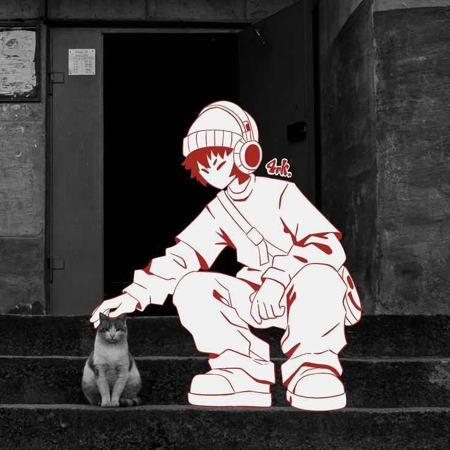
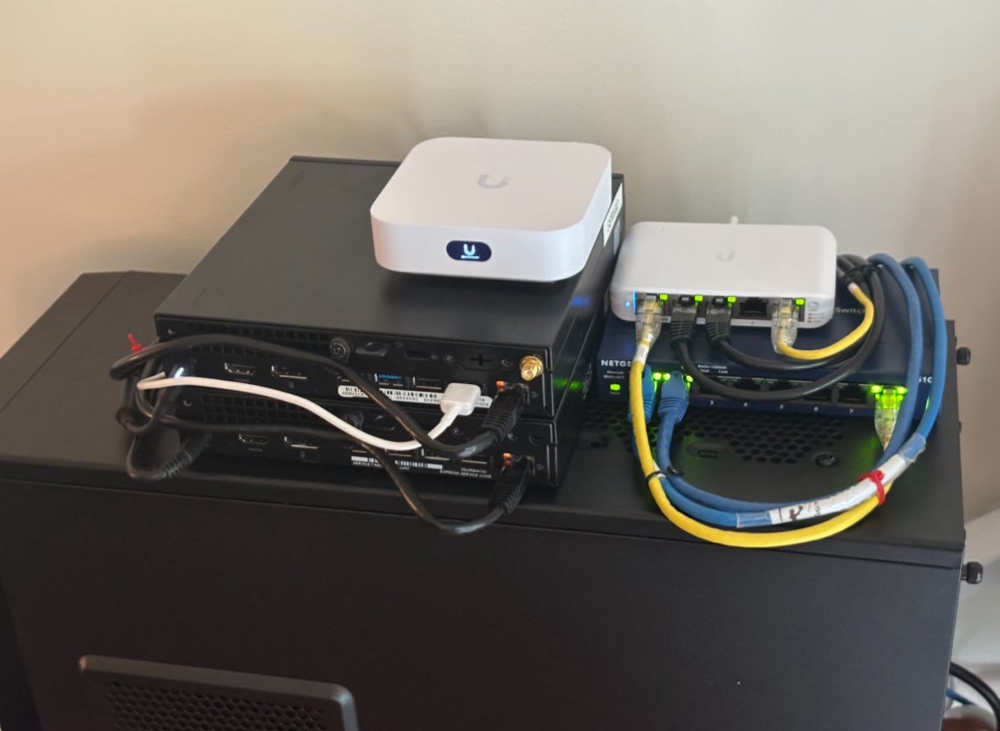
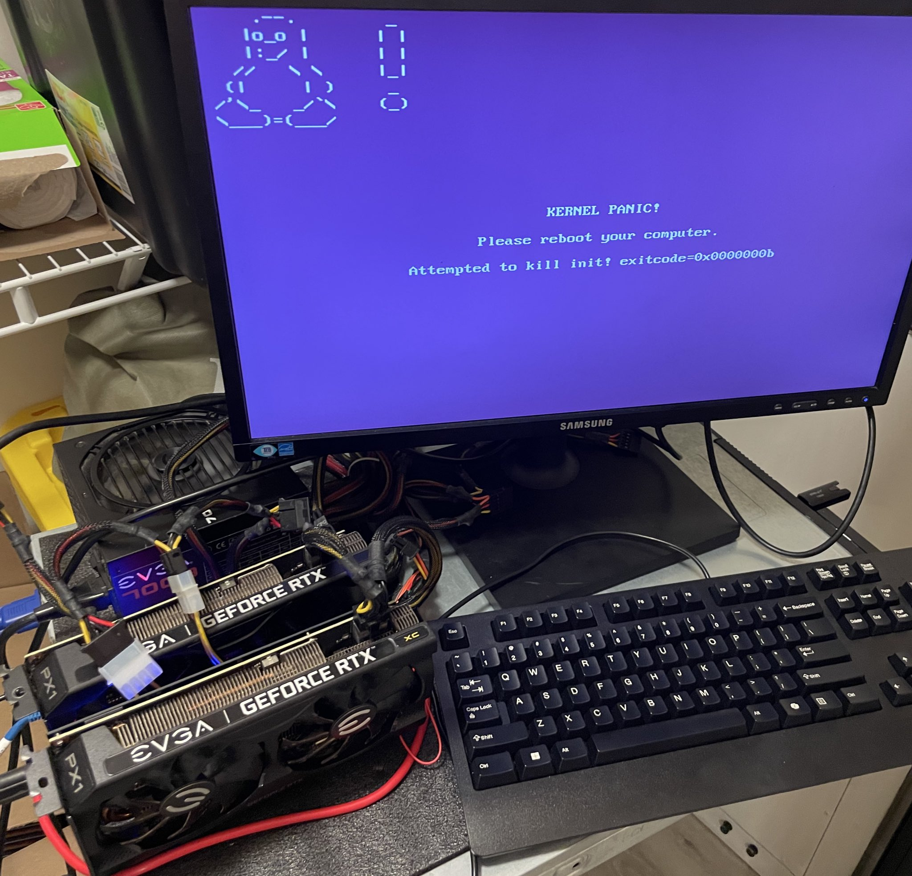
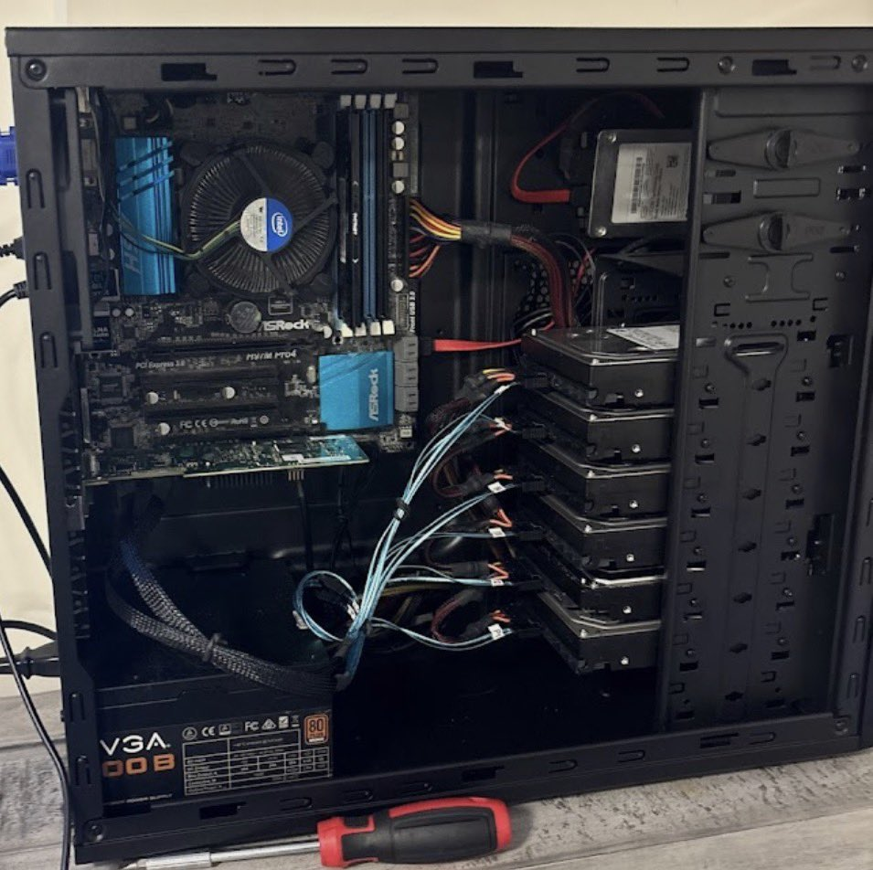
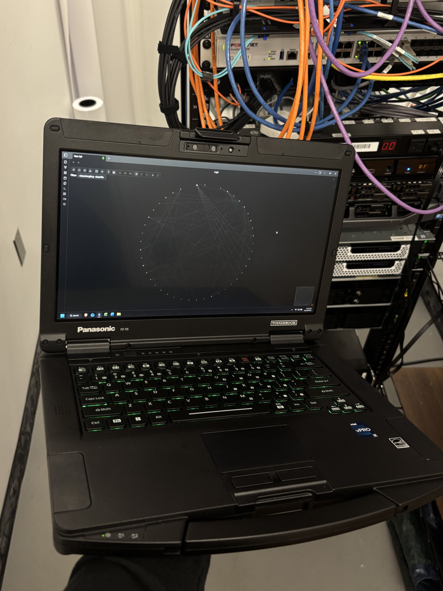
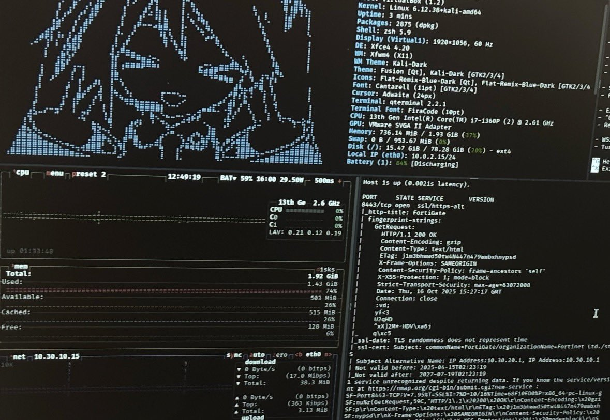
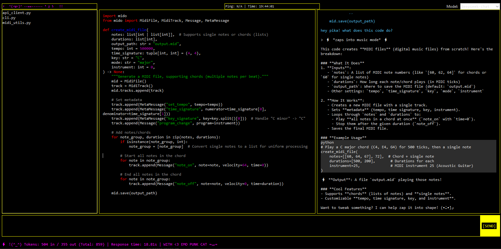

<!DOCTYPE html>
<html lang="en">
<head>
    <meta charset="UTF-8">
    <meta name="viewport" content="width=device-width, initial-scale=1.0">
    <title>>_< // JOHANN</title>
    
    <link href="https://fonts.googleapis.com/css2?family=Space+Grotesk:wght@900&family=Space+Mono:wght@400;700&family=Noto+Sans+JP:wght@900&display=swap" rel="stylesheet">
    
</head>
<body class="p-4 md:p-8">
    

    <!-- Header Section -->
    <header class="mb-12 max-w-7xl mx-auto scroll-fade">
        

            

                

                    Raleigh, NC
                    Open_Source_Infrastructure
                

                <h1 class="text-6xl sm:text-7xl lg:text-8xl font-black uppercase leading-[0.85] tracking-tighter scroll-fade delay-2">
                    J.  JOHANN                        
                </h1>
            

            
            

                22YR | PROFESSIONAL SINCE 2022 | SECURITY & LLMs
            

        

        

            

                LINUX CONTAINERIZATION — DATA RECONCILIATION — GPEN CERTIFIED — PROXMOX HYPERVISORS — AUTOMATION_FIRST — ZERO TRUST ARCHITECTURE — BASH & PYTHON EXPERT — 
            

        

    </header>

    

        
        <!-- Sidebar: Spec Data -->
        <aside class="lg:col-span-4 space-y-8">
            

                

                    Auth: GPEN_SANS
                

                <h2 class="text-2xl font-black uppercase italic mb-6 border-b-2 border-black pb-2">Primary_Specs</h2>
                <table class="mono text-[10px]">
                    <thead>
                        <tr>
                            <th>Stack</th>
                            <th>Version Status</th>
                        </tr>
                    </thead>
                    <tbody>
                        <tr><td>Hobbies/td><td>LLM / Cars / Dev Projects</td></tr>
                        <tr><td>Vanity</td><td>GPEN / Sec+ / eJPT</td></tr>
                        <tr><td>Current Workflow</td><td>Idea -> Roadmap -> visualize -> phased dev -> (realise I could have saved 8 hours with an existing library)</td></tr>
                    </tbody>
                </table>
                
                <!-- Profile Image -->
                

                    
                

            

            <!-- Certifications Block -->
            

                <h3 class="text-xl font-black uppercase italic border-b-2 border-black pb-2 mb-4">Certifications</h3>
                <ul class="mono text-xs space-y-3">
                    <li class="flex items-center gap-2">
                        ✓ SANS GPEN (Penetration Tester)
                    </li>
                    <li class="flex items-center gap-2">
                        ✓ CompTIA Security+
                    </li>
                    <li class="flex items-center gap-2">
                        ✓ eJPT (Junior Pen Tester)
                    </li>
                    <li class="flex items-center gap-2">
                         ...More when I have the funding ^_^
                    </li>
                </ul>
            

        </aside>

        <!-- Main Body: Logs and Features -->
        <main class="lg:col-span-8 space-y-8">
            
            <!-- Homelab Gallery -->
            

                <h3 class="text-xl font-black uppercase italic mb-4">Homelab Gallery</h3>
                

                    

                        
                    

                    

                        
                    

                    

                        
                    

                    

                        
                    

                    

                        
                    

                    

                        
                    

                

            

            <!-- Homelab Architecture Section -->
            <section class="grid grid-cols-1 md:grid-cols-2 gap-6">
                

                    <h3 class="text-xl font-black uppercase italic mb-4">homelab specs</h3>
                    <ul class="mono text-xs space-y-2">
                        <li>> BARE METAL: 2x Optiplex 3050 1x Razer Laptop 17" </li>
                        <li>> HYPERVISOR: Proxmox VE 8.x</li>
                        <li>> STORAGE: DIY TRUENAS ZFS RAID-5 (6x 2TB SAS)</li>
                        <li>> NETWORK: Unifi/Adgaurd/Tailscale</li>
                    </ul>
                

                

                    <h3 class="text-xl font-black uppercase italic mb-4 text-white">Security_Tools</h3>
                    

                        METASPLOIT
                        BURPSUITE
                        OSQUERY
                        YARA
                        BLOODHOUND
                    

                

            </section>
        </main>
    

    <!-- Footer Graphic Area -->
    <footer class="mt-16 border-t-8 border-black pt-8 max-w-7xl mx-auto">
        

            

                OPEN SRC AMBASSADOR
                MAKE ACCESS ACCESIBLE
            

            
            

                Direct_Link
                <a href="mailto:johann@gmail.com" class="text-base font-black underline hover:bg-black hover:text-white transition-all break-words">johann@gmail.com</a>
                
連絡する

            

        

        

            
> Dedicated to Open Source LLM access & automation

            

                J_JOHANN_v2026.4
                RALEIGH NC
            

        

    </footer>

    
</html>